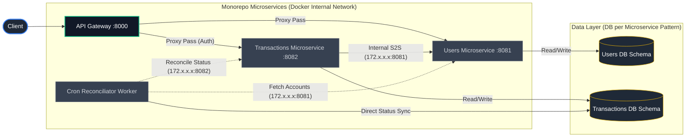
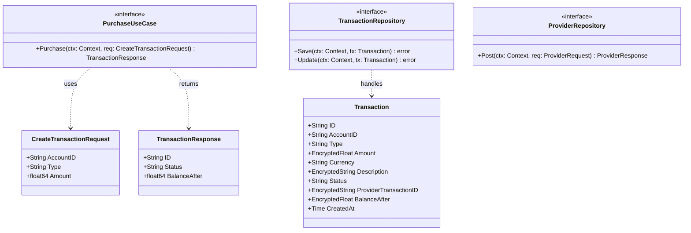

# Spin Backend Challenge — Transaction Execution API

Este repositorio contiene la solución completa para el reto técnico de procesamiento de transacciones financieras, implementada bajo una arquitectura de microservicios robusta, segura y altamente escalable en Go 1.25.

---

## 🏗️ Arquitectura del Sistema

El sistema está diseñado bajo los principios de **Clean Architecture** (Arquitectura Hexagonal) y segregación de responsabilidades. Para desarrollo local se orquesta en Docker, implementando una topología modular de alto rendimiento:



### UML de Arquitectura Hexagonal (Capa Core)
A continuación, el diagrama de clases modelando el core del microservicio de transacciones, separando las **Entidades**, los **Casos de Uso (Puertos de Entrada)** y los **Repositorios (Puertos de Salida)**:



### Stack Tecnológico:
* **Lenguaje:** Go 1.25
* **Framework:** Echo v4
* **Bases de Datos & Caché:** PostgreSQL 15, Redis 7
* **Mensajería Event-Driven:** Apache Kafka
* **Infraestructura & CI/CD:** Docker BuildKit, GitHub Actions

### Componentes:
* **API Gateway (`cmd/gateway` - :8000):** Único punto de entrada público. Provee documentación Swagger, auditoría, control de pánicos, CORS, y redirige el tráfico.
* **Users Service (`cmd/users` - :8081):** Servicio encargado del registro, autenticación, generación de firmas JWT y endpoint interno S2S para validar la existencia de cuentas.
* **Transactions Service (`cmd/transactions` - :8082):** Core de negocio. Recibe peticiones de crédito y débito, aplica validaciones, maneja caché de idempotencia, y utiliza Goroutines asíncronas para publicar a Kafka y Redis sin penalizar la latencia HTTP.
* **Cron Reconciliator (`cmd/crons`):** Worker en segundo plano que busca periódicamente transacciones en estado `PENDING` (por caídas del proveedor) y las reintenta.
* **Provider Mock (`mocks/providers` - :8083):** Servidor HTTP que emula la red del proveedor bancario, permitiendo inyectar fallos de red (`X-Mock-Id`) para pruebas de resiliencia.

---

## 📂 Estructura del Monorepo y Clean Architecture

El proyecto está estructurado como un **Monorepo** que aloja múltiples microservicios. Para garantizar la mantenibilidad y evitar el acoplamiento ("Código Espagueti"), el repositorio se divide en código orquestador, librerías utilitarias (`pkg`) y la implementación de la **Arquitectura Hexagonal (Puertos y Adaptadores)** encapsulada para cada microservicio:

* **`.github/`**: Flujos de trabajo de CI/CD automatizados (GitHub Actions).
* **`cmd/`**: Puntos de entrada (entrypoints `main.go`) de los microservicios. Aquí se inyectan dependencias y se levanta la infraestructura web.
  * `gateway/`: Reverse Proxy y capa pública.
  * `transactions/`: Microservicio core de finanzas.
  * `users/`: Microservicio de identidades.
  * `crons/`: Worker en segundo plano para conciliación.
* **`docs/`**: Documentación complementaria del proyecto.
  * Contiene estrategias de IA y nuestro archivo de pruebas automatizadas `CURL_TESTS.md`.
* **`env/`**: Lógica estandarizada para la carga, parseo y validación de variables de entorno usando tipado fuerte.
* **`mocks/`**: Emuladores de dependencias externas.
  * `provider_mock/`: Emula al proveedor bancario permitiendo inyectar fallos (ej. 500, fondos insuficientes).
* **`opt/`**: Configuraciones transversales compartidas por el monorepo.
  * Router global, inicializadores de Base de Datos y Middlewares HTTP globales.
* **`pkg/`**: Librerías internas reusables (Totalmente Agnósticas al Dominio).
  * `cache`: Abstracción de Redis.
  * `crypto`: Funciones de cifrado AES-256-GCM para datos sensibles en reposo.
  * `errs`: Estandarización de errores HTTP y de negocio.
  * `events`: Publicador asíncrono hacia Kafka.
  * `sigil`: Middleware de firmas criptográficas HMAC para asegurar el tráfico S2S.
  * *(Regla estricta: Ningún paquete dentro de `pkg` debe importar a otro de `pkg`)*.
* **`srv/`**: La lógica Core donde reside la **Arquitectura Hexagonal** pura. Cada microservicio (ej. `transactions`) cuenta con:
  * `domain/`: Entidades de negocio sin dependencias a frameworks.
  * `ports/`: Interfaces y contratos (Inversión de Dependencias).
  * `usecases/`: La lógica y reglas de negocio puras.
  * `handlers/`: Controladores HTTP Echo (Adaptador de entrada).
  * `repositories/`: Conexiones a PostgreSQL, Redis y APIs (Adaptadores de salida).

---

## 🔒 Decisiones de Diseño y Performance

### 1. Cifrado de Datos en Reposo (Transparent Field Encryption)
Implementamos **cifrado en reposo** de los campos sensibles (`amount`, `description`, `provider_transaction_id`, `balance_after`) usando **AES-256-GCM** y un vector de inicialización (IV) criptográfico aleatorio único por registro, directamente a nivel de Driver SQL.

### 2. Idempotencia y Mensajería Asíncrona (Fire-and-Forget)
* **Redis:** Las transacciones utilizan un mecanismo de Idempotencia almacenado en Redis para evitar cobros duplicados antes de insertar en base de datos.
* **Kafka:** Una vez que la transacción es confirmada, se notifica asíncronamente vía un topic de Kafka (`transaction-completed`).
* **Goroutines:** Para garantizar latencias sub-milisegundo, las escrituras en Kafka y actualizaciones en Redis se desacoplaron del request principal usando Goroutines (patrón *Fire-and-Forget*) con contextos independientes (`context.Background()`), evitando cancelar las tareas en background cuando la petición HTTP del usuario finaliza.

### 3. Comunicación S2S Segura (Sigil Authentication)
Los endpoints internos (como consultas cruzadas de microservicios) están protegidos mediante **Sigil**, un middleware que firma y verifica los payloads usando un secreto HMAC compartido. Esto evita que actores maliciosos manipulen datos directamente saltándose el Gateway.

### 4. Docker BuildKit Optimization
El `Dockerfile` del ecosistema emplea montajes de caché nativos de BuildKit (`--mount=type=cache,target=/go/pkg/mod`). Esto significa que en el monorepo, los 5 microservicios comparten y reciclan la misma carpeta temporal de dependencias, reduciendo dramáticamente el tiempo de compilación.

---

## 🚀 Guía de Ejecución Rápida

La automatización de tareas se realiza a través de un **Taskfile**. Asegúrate de tener instalado `task` (o puedes ejecutar directamente los comandos de `docker-compose`).

### Levantar todo el ecosistema
Levanta Postgres, Kafka, Redis y compila e inicia los 5 servicios en contenedores aislados:
```bash
task up
```

Una vez levantado, los servicios locales estarán expuestos en:
* **API Gateway:** `http://localhost:8000` (Usar este para peticiones externas)
* **Documentación Swagger:** `http://localhost:8000/swagger/index.html`
* **Transacciones Internas:** `http://localhost:8082`

### Realizar Pruebas
Si quieres probar la creación de transacciones o simular errores (como caídas del proveedor o fondos insuficientes), dirígete al archivo que preparamos con todos los comandos `curl` listos para usar:
👉 **[Documentación de Pruebas cURL](docs/CURL_TESTS.md)**

### Detener el entorno
```bash
task down
```

### Limpiar Bases de Datos y Volúmenes
Apaga los contenedores y destruye los volúmenes de datos persistidos para iniciar de cero:
```bash
task reset
```

### 🧪 Reportes y Ejecución de Pruebas

El proyecto cuenta con un conjunto extenso de pruebas (Unitarias y E2E). Al ejecutarlas mediante el **Taskfile**, los resultados se guardan automáticamente en archivos de texto dentro del directorio `docs/` para facilitar su revisión o auditoría:

#### 1. Pruebas Unitarias ("Table-Driven Tests")
Para ejecutar los cientos de casos de uso cubiertos (incluyendo escenarios positivos y negativos) y generar el reporte de consola en un archivo:
```bash
task test
```
* Genera el fichero: `docs/UNIT_TEST_RESULTS.txt`

#### 2. Reporte de Cobertura (Coverage)
Para ejecutar los tests calculando la cobertura del código y generar un reporte detallado paquete por paquete:
```bash
task test-coverage
```
* Genera el fichero: `docs/COVERAGE_REPORT.txt`

> **Cobertura Actual:**
> * **General:** **>81%** (`81.2%`)
> * **Capa de Negocio Core (`usecases`, `repositories`, `handlers`, `pkg`, `opt`):** **~95-100%** 
> *(El porcentaje global se ve reducido únicamente por los ejecutables `main` en `cmd/` que son de infraestructura).*

#### 3. Pruebas End-to-End (E2E) con cURL
Existe un script (`scripts/test_api.sh`) que simula peticiones reales, incluyendo casos de éxito, paginación, filtros combinados, inyección de fallos (Mock Errors 500) y rechazos por límite de fondos. Para ejecutarlo automatizadamente:
```bash
task test-api
```
* Genera el fichero: `docs/E2E_TEST_RESULTS.txt`

#### 4. Postman Collection
Para probar la API de forma visual y manual, hemos generado una colección lista para importar en Postman.
* Encuentra el fichero en: `docs/Bank_API_Postman_Collection.json`
*(La colección incluye scripts automáticos que guardan el JWT de la respuesta de Signup/Login y lo inyectan en el resto de los requests).*
*(El proyecto incluye además un Pipeline de GitHub Actions automatizado que primero valida el coverage de los tests y luego, en paralelo, genera los specs de Swagger, compila los microservicios y valida la infraestructura).*

---

## 🤖 Uso de Inteligencia Artificial

De acuerdo a las directrices del challenge, documentamos el uso de IA (Agentes Autónomos y LLMs) durante el desarrollo para áreas como andamiaje inicial (boilerplate), refactorización (inyección de dependencias), setup de Docker BuildKit multi-stage, y TDD.
